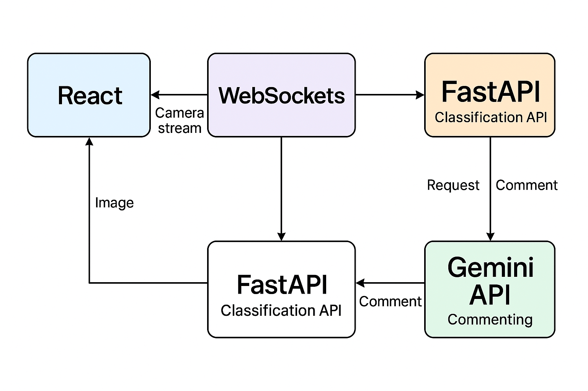

# PlumVision – JCIA Hackathon 2025
---

## Table des Matières
- [PlumVision – JCIA Hackathon 2025](#plumvision--jcia-hackathon-2025)
  - [Table des Matières](#table-des-matières)
  - [C'est quoi PlumVision ?](#cest-quoi-plumvision-)
  - [Objectif (Prototype)](#objectif-prototype)
  - [Fonctionnalités Clés (Prototype)](#fonctionnalités-clés-prototype)
  - [Stack Technique (Prototype)](#stack-technique-prototype)
  - [Architecture du Système (Prototype)](#architecture-du-système-prototype)
  - [Cas d’usage typique (Prototype – Démonstration)](#cas-dusage-typique-prototype--démonstration)
  - [Backend – Fonctionnement (Prototype)](#backend--fonctionnement-prototype)
  - [Frontend – Fonctionnalités (Prototype)](#frontend--fonctionnalités-prototype)
  - [Plan de travail – 6 Periode pour avoir le Prototype](#plan-de-travail--6-periode-pour-avoir-le-prototype)
    - [Periode 1 – Dataset \& Préparation](#periode-1--dataset--préparation)
    - [Periode 2 – Sélection et Entraînement du Modèle](#periode-2--sélection-et-entraînement-du-modèle)
    - [Periode 3 – Développement du Backend (API et Temps Réel avec Suivi)](#periode-3--développement-du-backend-api-et-temps-réel-avec-suivi)
    - [Periode 4 – Développement du Frontend (Interface Utilisateur, Flux Caméra et Statistiques)](#periode-4--développement-du-frontend-interface-utilisateur-flux-caméra-et-statistiques)
    - [Periode 5 – Intégration et Tests](#periode-5--intégration-et-tests)
    - [Periode 6 – Préparation de la Démonstration et de la Présentation](#periode-6--préparation-de-la-démonstration-et-de-la-présentation)
  - [Checklist finale (Prototype)](#checklist-finale-prototype)
  - [Structure de la Base de Données (SQLite - Prototype)](#structure-de-la-base-de-données-sqlite---prototype)
  - [Outils Backend](#outils-backend)
  - [Structure Actuelle du Projet](#structure-actuelle-du-projet)
  - [Équipe](#équipe)

---

## C'est quoi PlumVision ?

**PlumVision** est une solution intelligente conçue pour automatiser le tri de prunes africaines. Ce prototype vise à démontrer la faisabilité d'une classification en temps réel des prunes à l'aide de modèles de machine learning et d'une interface utilisateur interactive.

---

## Objectif (Prototype)

Développer un prototype capable de classifier en temps réel des prunes africaines via une caméra connectée dans l'une des **6 catégories principales** : bonne qualité, non mûre, tachetée, fissurée, meurtrie, pourrie. L'objectif principal est de démontrer la fonctionnalité de classification en temps réel, le suivi des statistiques de session et de fournir une interface utilisateur basique pour l'interaction et la visualisation des résultats.

---

## Fonctionnalités Clés (Prototype)

* **Classification en Temps Réel :** Analyse du flux vidéo d'une caméra connectée pour classifier les prunes.
* **Upload d'Image :** Possibilité d'uploader une image de prune pour obtenir une prédiction unique.
* **Statistiques de Session :** Suivi en temps réel du nombre total de prunes traitées et de la répartition par catégorie durant une session de scan.
* **Interface Utilisateur Interactive :** Interface web simple pour démarrer/arrêter les sessions, visualiser le flux de la caméra, les prédictions et les statistiques.
* **Commentaires IA :** Génération automatique de commentaires sur la qualité globale du tri via l'API Gemini.

---

## Stack Technique (Prototype)

| Composant         | Outils / Langages                                                              |
|-------------------|------------------------------------------------------------------------------|
| **Modèles ML** | PyTorch, YOLOv8-cls, EfficientNetB0, RexNet, MobileNetV3, ...                |
| **Backend API** | **FastAPI** (pour sa rapidité et ses fonctionnalités) + Uvicorn (serveur ASGI) |
| **Frontend** | **React** + Axios + Chart.js                                                 |
| **Temps Réel** | **WebSockets** (communication bidirectionnelle et un flux continu de données) |
| **IA Générative** | Gemini API                                                                   |
| **Entraînement** | Jupyter Notebooks + PyTorch + Scripts Python                                 |
| **Stockage/DB** | SQLite (Prototype)                                                           |
| **Dataset** | African Plums Dataset (Kaggle)                                               |

---

## Architecture du Système (Prototype)



Le système comprend un frontend **React** pour l'interface utilisateur, un backend **FastAPI** pour l'API et la logique de classification, une communication en temps réel via **WebSockets** pour le flux de la caméra et les statistiques, et l'intégration de l'**API Gemini** pour les commentaires.

---

## Cas d’usage typique (Prototype – Démonstration)

> **Démonstration du prototype :**
>
> 1.  L'utilisateur lance l'application web.
> 2.  Dans la section de prédiction, l'utilisateur **démarre une session de scan en temps réel**, permettant d'accéder à la caméra connectée.
> 3.  Le frontend **capture des images** du flux vidéo à une fréquence déterminée et les envoie au backend via WebSockets.
> 4.  Le backend **classifie** chaque prune (via le modèle sélectionné) et **met à jour les statistiques de la session** (nombre total d'images traitées, nombre de prunes prédites par catégorie).
> 5.  Le backend **renvoie ces statistiques** au frontend en temps réel.
> 6.  L'interface affiche en direct :
>     * Le flux de la caméra.
>     * La catégorie prédite pour chaque prune détectée (potentiellement superposée).
>     * Une **section dédiée affichant les statistiques de la session en cours** (nombre total de prunes, répartition par catégorie).
>     * Un **commentaire généré par Gemini** sur la qualité globale (basé sur les classifications en temps réel).
> 7.  L'utilisateur a la possibilité d'**arrêter la session de scan** à tout moment.

---

## Backend – Fonctionnement (Prototype)

* **/predict** : reçoit une image (upload), retourne la prédiction.
* **/stream** : gère le flux vidéo de la caméra via **WebSockets**.
    * Reçoit les images capturées par le frontend.
    * Effectue la prédiction sur chaque image.
    * **Maintient des compteurs en mémoire pour la session en cours :**
        * Nombre total d'images traitées.
        * Nombre de prédictions par catégorie.
    * **Retourne au frontend :**
        * La prédiction pour l'image courante (potentiellement).
        * Les statistiques de la session mises à jour.
* **/metrics** : retourne les statistiques de la session actuelle (nombre total, répartition).
* **Gemini Integration** : génère un commentaire simple basé sur les statistiques de classification en temps réel.
* **Session Management** : gère l'état de la session (active/inactive) et stocke les données de session en mémoire ou dans un fichier SQLite temporaire.

---

## Frontend – Fonctionnalités (Prototype)

* **Section Présentation :** Description concise du projet PlumVision et les noms des membres de l'équipe.
* **Section Prédiction :**
    * Possibilité d'**uploader une image** pour obtenir une prédiction instantanée.
    * **Session de scan en temps réel :**
        * Bouton pour **démarrer** et **arrêter** la session.
        * Accès à la caméra de l'utilisateur (via l'API du navigateur).
        * Affichage du flux vidéo dans un élément `<video>`.
        * **Capture d'images du flux vidéo à une fréquence déterminée.**
        * Envoi des images capturées au backend via WebSockets.
        * Affichage en direct du flux de la caméra et des prédictions superposées ou affichées à côté.
        * **Affichage en temps réel des statistiques de la session :**
            * Nombre total de prunes traitées.
            * Répartition par catégorie (sous forme de texte ou d'un graphique simple).
* **Section Dashboard :**
    * Affichage du **nombre total de prunes traitées** durant la session (après son arrêt).
    * Un **graphique simple (Chart.js)** montrant la répartition des prunes par catégorie pour la session en cours (après son arrêt).

---

## Plan de travail – 6 Periode pour avoir le Prototype

### Periode 1 – Dataset & Préparation
* Sélection et organisation d'un sous-ensemble représentatif du dataset pour le prototype.
* Vérification et préparation des données pour l'entraînement et les tests rapides.
* Configuration de l'environnement de développement et du contrôle de version (GitHub).

### Periode 2 – Sélection et Entraînement du Modèle
* Choix d'un modèle principal (**YOLOv8-cls** ou **EfficientNetB0**) pour le prototype, basé sur les premiers tests de précision et de rapidité.
* Adaptation du dataset au format requis par le modèle choisi.
* Entraînement rapide du modèle sur le sous-ensemble de données.
* Sauvegarde du modèle entraîné.

### Periode 3 – Développement du Backend (API et Temps Réel avec Suivi)
* Mise en place d'une API avec **FastAPI**.
* Création d'un endpoint **/predict** pour recevoir une image et retourner la prédiction du modèle.
* Implémentation de la gestion des données de session (en mémoire ou via **SQLite**), incluant le suivi du nombre total d'images traitées et des prédictions par catégorie.
* Création d'un endpoint **/metrics** pour retourner les statistiques de la session.
* **Implémentation de la gestion des WebSockets pour le flux de caméra en temps réel**, incluant la réception des images, la prédiction, la mise à jour des statistiques de session et l'envoi de ces statistiques au frontend.
* Intégration basique de l'**API Gemini** pour générer un commentaire sur les résultats en temps réel (basé sur les statistiques).

### Periode 4 – Développement du Frontend (Interface Utilisateur, Flux Caméra et Statistiques)
* Création de la structure de base de l'application **React** avec les trois sections (Présentation, Prédiction, Dashboard).
* Implémentation de la fonctionnalité d'upload d'image dans la section Prédiction.
* **Implémentation de la gestion de la session de scan en temps réel dans la section Prédiction :**
    * Boutons de démarrage et d'arrêt de la session.
    * Accès à la caméra de l'utilisateur.
    * Affichage du flux vidéo.
    * **Capture d'images à une fréquence déterminée (par exemple, toutes les 0.5 secondes).**
    * **Établissement et gestion de la connexion WebSocket avec le backend.**
    * **Envoi des images capturées au backend via WebSockets.**
    * **Affichage en temps réel des statistiques de la session reçues du backend.**

### Periode 5 – Intégration et Tests
* Intégration complète du frontend avec le backend, y compris le flux de caméra en temps réel et la mise à jour des statistiques via WebSockets.
* Tests fonctionnels approfondis de l'ensemble du prototype (upload, prédiction, scan en temps réel, affichage des statistiques, commentaire Gemini, démarrage/arrêt de session).
* Optimisation du flux en temps réel pour une latence minimale et une gestion efficace des ressources.
* Correction des bugs et améliorations de l'interface utilisateur.

### Periode 6 – Préparation de la Démonstration et de la Présentation
* Préparation d'une courte vidéo de démonstration du prototype (≤ 2 min) mettant en évidence le fonctionnement en temps réel et l'affichage des statistiques.
* Création d'une présentation concise mettant en évidence les fonctionnalités et les résultats du prototype.
* Finalisation du dépôt GitHub pour la soumission.

---

## Checklist finale (Prototype)

| Élément                                                              | Statut |
|----------------------------------------------------------------------|--------|
| Dataset sélectionné et préparé                                     | **Done** |
| Modèle principal entraîné et sauvegardé                           | **Done** |
| API FastAPI fonctionnelle avec prédiction                           | ⬜     |
| Gestion des données de session avec suivi des statistiques         | ⬜     |
| Endpoint /metrics fonctionnel                                      | ⬜     |
| Intégration simple de Gemini                                        | ⬜     |
| Section Présentation du frontend                                   | ⬜     |
| Fonctionnalité d'upload d'image                                     | ⬜     |
| **Accès à la caméra, capture d'images et flux en temps réel fonctionnel** | ⬜     |
| Communication Frontend-Backend via WebSockets pour le flux et les stats | ⬜     |
| **Affichage en temps réel des statistiques de session sur le frontend** | ⬜     |
| Fonctionnalité de démarrage et d'arrêt de session                   | ⬜     |
| Section Dashboard avec statistiques (après arrêt session)          | ⬜     |
| Démo vidéo préparée                                                | ⬜     |
| Présentation préparée                                              | ⬜     |
| Dépôt GitHub prêt pour la soumission                               | ⬜     |

---

## Structure de la Base de Données (SQLite - Prototype)

Pour le prototype, une structure simple avec une seule table ou deux maxi pour stocker les informations de session.

**Table: `sessions`**

| Colonne           | Type     | Description                                                    |
|-------------------|----------|----------------------------------------------------------------|
| `session_id`      | INTEGER  | Clé primaire, identifiant unique de la session               |
| `start_time`      | DATETIME | Timestamp du début de la session                             |
| `end_time`        | DATETIME | Timestamp de la fin de la session                             |
| `total_plums`     | INTEGER  | Nombre total de prunes traitées                                |
| `category_counts` | TEXT     | JSON string représentant le compte par catégorie              |
| `gemini_summary`  | TEXT     | Résumé généré par l'API Gemini                                 |

**Table: `predictions` (Pour un historique plus détaillé)**

| Colonne           | Type     | Description                                                       |
|-------------------|----------|-------------------------------------------------------------------|
| `prediction_id`   | INTEGER  | Clé primaire, identifiant unique de la prédiction                |
| `session_id`      | INTEGER  | Clé étrangère référençant la table `sessions`                    |
| `image_name`      | TEXT     | Nom du fichier image                                              |
| `predicted_class` | TEXT     | Catégorie prédite pour la prune                                 |
| `prediction_time` | DATETIME | Timestamp de la prédiction                                      |

Pour le prototype, on pourrait commencer par stocker les données de session dans un dictionnaire en mémoire et envisager **SQLite** si on souhaite une persistance basique entre les exécutions de l'API.

---

## Outils Backend

Pour atteindre nos objectifs, je propose **FastAPI** comme framework backend principal. Sa nature asynchrone et sa bonne intégration avec les **WebSockets** en font un choix judicieux pour gérer le flux de données en temps réel et les mises à jour des statistiques.

Pour la gestion des WebSockets dans FastAPI, on peut utiliser les fonctionnalités intégrées basées sur **Starlette**. On devra définir un endpoint WebSocket qui gérera la connexion, la réception des images, l'exécution des prédictions, la mise à jour des compteurs de session et l'envoi des statistiques au frontend.

En complément :

* **Uvicorn:** Sera notre serveur ASGI pour faire fonctionner l'application FastAPI, pour de bonnes performances pour les applications asynchrones et WebSocket.
* **PyTorch:** Pour charger et exécuter notre modèle de deep learning pour la prédiction.
* **SQLite:** Pour le stockage basique des données de session.
* **Google AI Gemini API:** Pour générer les commentaires textuels basés sur les résultats du tri.

Pour le frontend :

* **React:** Une librairie JavaScript robuste pour construire des interfaces utilisateur dynamiques et réactives, pour gérer le flux de la caméra, la communication WebSocket et l'affichage des statistiques en temps réel.
* **TailwindCSS:** pour styliser rapidement l'interface utilisateur.
* **Axios:** pour effectuer des requêtes vers l'API backend (pour l'upload d'image et potentiellement pour récupérer les statistiques de session après l'arrêt).
* **Chart.js:** pour la création de graphiques simple et efficace pour visualiser la répartition des catégories de prunes.

---

## Structure Actuelle du Projet

```bash

├── JCIA_PLUM_DATA_CHALLENGE/
│   ├── .gitattributes
│   ├── .gitignore
│   ├── Plan.md
│   ├── prompt.txt
│   ├── untrack.sh
│   ├── african_plums_dataset/
│   │   ├── README.md
│   │   ├── data.yaml
│   │   ├── organized_plums_data_new.csv
│   │   ├── processed_csv.csv
│   │   ├── african_plums/
│   │   │   ├── bruised/
│   │   │   ├── cracked/
│   │   │   ├── rotten/
│   │   │   ├── spotted/
│   │   │   ├── unaffected/
│   │   │   ├── unripe/
│   │   ├── cleaned_data/
│   │   │   ├── class_weights.json
│   │   │   ├── test/
│   │   │   │   ├── bruised/
│   │   │   │   ├── cracked/
│   │   │   │   ├── rotten/
│   │   │   │   ├── spotted/
│   │   │   │   ├── unaffected/
│   │   │   │   ├── unripe/
│   │   │   ├── train/
│   │   │   │   ├── bruised/
│   │   │   │   ├── cracked/
│   │   │   │   ├── rotten/
│   │   │   │   ├── spotted/
│   │   │   │   ├── unaffected/
│   │   │   │   ├── unripe/
│   │   │   ├── val/
│   │   │   │   ├── bruised/
│   │   │   │   ├── cracked/
│   │   │   │   ├── rotten/
│   │   │   │   ├── spotted/
│   │   │   │   ├── unaffected/
│   │   │   │   ├── unripe/
│   │   ├── defect_data/
│   │   │   ├── class_weights.json
│   │   │   ├── test/
│   │   │   │   ├── bruised/
│   │   │   │   ├── cracked/
│   │   │   │   ├── rotten/
│   │   │   │   ├── spotted/
│   │   │   ├── train/
│   │   │   │   ├── bruised/
│   │   │   │   ├── cracked/
│   │   │   │   ├── rotten/
│   │   │   │   ├── spotted/
│   │   │   ├── val/
│   │   │   │   ├── bruised/
│   │   │   │   ├── cracked/
│   │   │   │   ├── rotten/
│   │   │   │   ├── spotted/
│   │   ├── Sets/
│   │   │   ├── test/
│   │   │   │   ├── bruised/
│   │   │   │   ├── cracked/
│   │   │   │   ├── rotten/
│   │   │   │   ├── spotted/
│   │   │   │   ├── unaffected/
│   │   │   │   ├── unripe/
│   │   │   ├── train/
│   │   │   │   ├── bruised/
│   │   │   │   ├── cracked/
│   │   │   │   ├── rotten/
│   │   │   │   ├── spotted/
│   │   │   │   ├── unaffected/
│   │   │   │   ├── unripe/
│   │   │   ├── val/
│   │   │   │   ├── bruised/
│   │   │   │   ├── cracked/
│   │   │   │   ├── rotten/
│   │   │   │   ├── spotted/
│   │   │   │   ├── unaffected/
│   │   │   │   ├── unripe/
│   │   ├── superclass_data/
│   │   │   ├── class_weights.json
│   │   │   ├── test/
│   │   │   │   ├── defective/
│   │   │   │   ├── unaffected/
│   │   │   │   ├── unripe/
│   │   │   ├── train/
│   │   │   │   ├── defective/
│   │   │   │   ├── unaffected/
│   │   │   │   ├── unripe/
│   │   │   ├── val/
│   │   │   │   ├── defective/
│   │   │   │   ├── unaffected/
│   │   │   │   ├── unripe/
│   ├── Models/
│   │   ├── Trained/
│   │   │   ├── CustomEfficientNet/
│   │   │   ├── CustomRexNet/
│   │   │   ├── efficientnetlite/
│   │   │   │   ├── defects/
│   │   │   │   ├── global/
│   │   │   │   ├── superclass/
│   │   │   ├── rexnet/
│   │   │   ├── yolo/
│   │   │   │   ├── yolov11n/
│   │   │   │   ├── yolov11s/
│   │   │   │   ├── yolov8n/
│   │   │   │   ├── yolov8s/
│   │   ├── Trained-DefectClass/
│   │   │   ├── yolo/
│   │   │   │   ├── yolov11n/
│   │   │   │   ├── yolov11s/
│   │   │   │   ├── yolov8n/
│   │   │   │   ├── yolov8s/
│   │   ├── Trained-Superclass/
│   │   │   ├── yolo/
│   │   │   │   ├── yolov11n/
│   │   │   │   ├── yolov11s/
│   │   │   │   ├── yolov8n/
│   │   │   │   ├── yolov8s/
│   │   ├── Untrained/
│   │   │   ├── yolov11/
│   │   │   │   ├── yolo11n-cls.pt
│   │   │   │   ├── yolo11s-cls.pt
│   │   │   ├── yolov8/
│   │   │   │   ├── yolov8n-cls.pt
│   │   │   │   ├── yolov8s-cls.pt
│   ├── Notebooks/
│   │   ├── EXPLORATION/
│   │   │   ├── DefectClassesSplit.ipynb
│   │   │   ├── Exploration.ipynb
│   │   │   ├── SuperClassSplit.ipynb
│   │   ├── REXNET_Experimentation/
│   │   │   ├── RexNetTraining.ipynb
│   │   │   ├── RexNet_Contrast.ipynb
│   │   ├── TRIPLET_Experimentation/
│   │   │   ├── CustomApproach.ipynb
│   │   ├── YOLO_Experimentation/
│   │   │   ├── DefectClassTraining.ipynb
│   │   │   ├── SuperClassTraining.ipynb
│   │   │   ├── YoloTraining.ipynb
│   ├── Plums/
│   │   ├── 1.jpeg
│   │   ├── 2.jpeg
│   │   ├── 3.jpeg
│   │   ├── 4.jpeg
│   │   ├── 5.jpeg
│   │   ├── 6.jpeg
│   ├── utilities/
│   │   ├── CustomDatasetLoader.py
│   │   ├── CustomEvaluation.py
│   │   ├── CustomTraining.py
│   │   ├── Helper.py
│   │   ├── PlumSetEval.py
│   │   ├── RunsEvaluator.py
│   │   ├── __init__.py
│   │   ├── utils.py
```

---

## Équipe

*PlumVision*