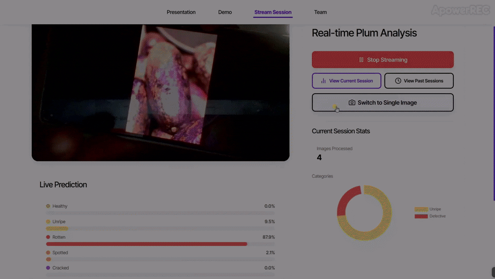
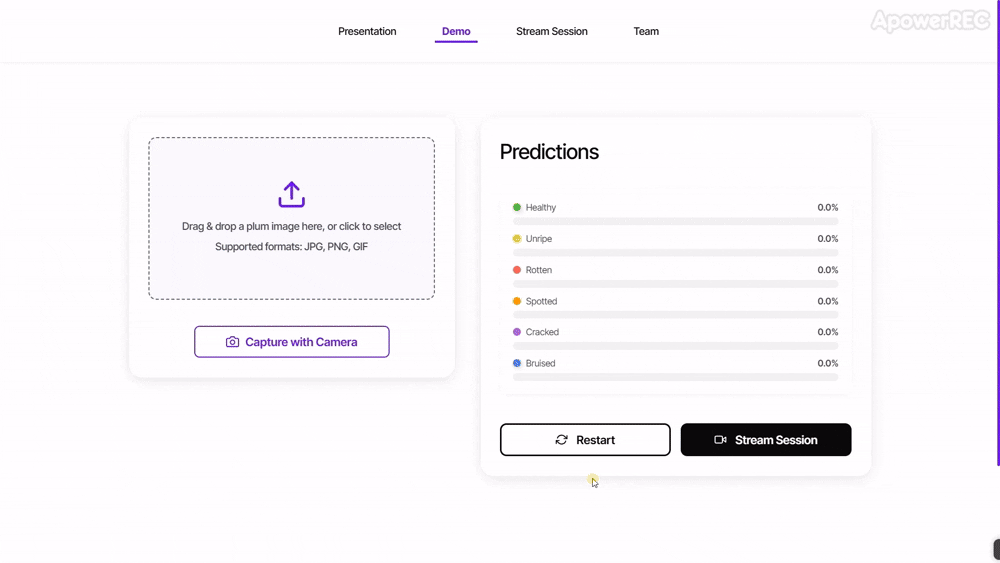

<h1 align="center">
  <br>
  <span style="font-size: 2.5em; font-weight: bold; color:rgb(219, 197, 255);">Plum</span><span style="font-size: 2.5em; font-weight: bold; color:rgb(131, 148, 245);">Vision</span>
  <br>
</h1>

<h4 align="center">An intelligent prototype for African plum sorting, developed for the JCIA Hackathon 2025.</h4>

<p align="center">
  <a href="https://github.com/GwadeSteve/JCIA_Plum_Challenge">
    
  </a>
  <a href="https://docs.google.com/document/d/1kwnXUpNghQ26GdF27YRTiQVNn4JaiepmSHreTG065LM/edit?pli=1&tab=t.0">
    
  </a>
</p>

<p align="center">
  <a href="#key-features">Key Features</a> •
  <a href="#demonstration">Demonstration</a> •
  <a href="#technologies">Technologies Used</a> •
  <a href="#repository-content">Repository Content</a> •
  <a href="#api-endpoints">API Endpoints</a> •
  <a href="#getting-started">Getting Started</a> •
  <a href="#troubleshooting">Troubleshooting</a> •
  <a href="#team">Team</a>
</p>

---

## Key Features

- Real-time analysis of camera video feed to classify plums
- Classification of plums into six quality categories: Good quality, Unripe, Spotted, Cracked, Bruised, Rotten
- Simple web user interface to visualize camera feed, predictions, and statistics
- Real-time tracking of total processed plums and their distribution by category (Session Statistics)
- Option to upload an image for a single prediction

---

## Demonstration

<div style="display: flex; flex-direction: row; align-items: center; margin-bottom: 30px;">
  <div style="flex: 2; padding-right: 20px;">
    <p align="center">
      <strong>Real-Time Classification</strong>
    </p>
    <p align="center">
      
    </p>
  </div>
  <div style="flex: 1; display: flex; flex-direction: column;">
    <div style="margin-bottom: 20px;">
      <p align="center">
        <strong>Image Upload Feature</strong>
      </p>
      <p align="center">
        
      </p>
    </div>
    <div>
      <p align="center">
        <strong>Session Statistics</strong>
      </p>
      <p align="center">
        
      </p>
    </div>
  </div>
</div>

---

## Technologies

- **Deep Learning Models:** PyTorch
- **Backend:** FastAPI
- **Frontend:** ReactJS
- **Database (Prototype):** SQLite

---

## Repository Content

```
JCIA_PLUM_DATA_CHALLENGE/
├── african_plums_dataset/          # Kaggle dataset (not tracked in Git)
│   ├── african_plums/              # Original dataset images
│   │   ├── bruised/
│   │   ├── cracked/
│   │   ├── rotten/
│   │   ├── spotted/
│   │   ├── unaffected/
│   │   └── unripe/
│   ├── Sets/                       # Full dataset splits
│   ├── defect_data/                # Defect classification datasets
│   ├── superclass_data/            # Superclass classification datasets
│   └── processed_csv.csv           # Dataset metadata
│
├── API/                            # FastAPI backend
│   ├── main.py                     # API entry point
│   ├── stream_manager.py           # WebSocket handler for real-time processing
│   ├── database.py                 # Database management
│   └── Predictor/                  # Model and prediction utilities
│       ├── best_model.pt           # Trained model weights
│       ├── meta_data.json          # Model metadata
│       └── predictor_utilities/    # Prediction helper functions
│
├── frontend/                       # React frontend
│   ├── public/                     # Public assets
│   └── src/                        # Source code
│       ├── components/             # UI components
│       ├── pages/                  # Application pages
│       └── services/               # API services
│
├── Models/                         # Trained models (not tracked in Git)
│
├── Notebooks/                      # Jupyter notebooks for experimentation
│   ├── EXPLORATION/                # Dataset preparation notebooks
│   ├── REXNET_Experimentation/     # ReXNet model experiments
│   ├── INCEPTION/                  # Inception model experiments
│   ├── MobileNetV3small/           # MobileNetV3 model experiments
│   ├── YOLO_Experimentation/       # YOLO model experiments
│   └── TRIPLET_Experimentation/    # Custom approaches
│
└── utilities/                      # Helper utilities
    ├── CustomDatasetLoader.py      # Dataset loading utilities
    ├── CustomTraining.py           # Training pipeline
    └── CustomEvaluation.py         # Model evaluation utilities
```

### Key Components

- **african_plums_dataset/**: Contains the African plums dataset from Kaggle and generated splits
  - You'll need to download the dataset and extract it to this folder
  - The exploration notebooks create organized data splits for different model experiments
  
- **API/**: FastAPI backend that serves predictions and manages real-time sessions
  - The API handles both image uploads and WebSocket connections for real-time video
  - Session data is stored in SQLite via SQLAlchemy ORM
  
- **frontend/**: React frontend providing an intuitive user interface
  - Displays real-time video stream with predictions overlaid
  - Visualizes session statistics with charts and summaries
  - Allows uploading individual images for classification
  
- **Notebooks/**: Comprehensive collection of Jupyter notebooks for experimentation
  - EXPLORATION notebooks prepare and analyze the dataset
  - Various model architectures implemented and compared
  - Performance metrics and visualization utilities included

---

## API Endpoints

The backend exposes the following key endpoints:

### REST Endpoints

- **POST /api/predict**
  - Upload an image for classification
  - Returns the plum category and confidence score
  - Optional query parameter: `session_id` to associate with a session
  - Example: `curl -X POST -F "file=@plum.jpg" http://localhost:8000/api/predict`

- **GET /api/predictions**
  - Retrieve recent predictions
  - Optional query parameter: `session_id` to filter by session
  - Optional query parameter: `limit` to control number of results
  - Example: `curl http://localhost:8000/api/predictions?session_id=abc123&limit=20`

- **GET /api/sessions**
  - List all scanning sessions
  - Optional query parameter: `active_only=true` to see only active sessions
  - Example: `curl http://localhost:8000/api/sessions?active_only=true`

- **GET /api/metrics/{session_id}**
  - Retrieve detailed statistics for a specific session
  - Returns counts by category and class, total processed, timing information
  - Example: `curl http://localhost:8000/api/metrics/abc123`

### WebSocket Endpoint

- **WebSocket /ws/stream**
  - Real-time bidirectional connection for video stream processing
  - Send video frames from camera to server
  - Receive predictions and updated statistics in real-time
  - Used by the frontend for live classification

Complete API documentation is available via Swagger UI after you start the backend server at `http://localhost:8000/docs`.

---

## Getting Started

### Prerequisites

- Python 3.8+ for the backend
- Node.js 16+ for the frontend
- Kaggle African Plums Dataset downloaded and extracted to the african_plums_dataset folder

### Dataset Setup

1. **Download the African Plums Dataset** from Kaggle: [African Plums Dataset](https://www.kaggle.com/datasets/arnaudfadja/african-plums-dataset)
2. **Extract the contents** to the african_plums_dataset directory in the project root
3. The dataset should contain folders for each plum category: bruised, cracked, rotten, spotted, unaffected, and unripe

### Getting Started
**Clone the repository**
```bash
git clone https://github.com/GwadeSteve/JCIA_Plum_Challenge.git
cd JCIA_Plum_Challenge
```

### Setting Up the Backend

1. **Create and activate a virtual environment**:

   ```bash
   # Windows
   python -m venv venv
   venv\Scripts\activate

   # macOS/Linux
   python -m venv venv
   source venv/bin/activate
   ```

2. **Install dependencies**:

   ```bash
   pip install -r requirements.txt
   ```

3. **Launch the API server**:

   ```bash
   cd API
   uvicorn main:app --reload --host 0.0.0.0 --port 8000
   ```

   The API will be accessible at [http://localhost:8000](http://localhost:8000), with Swagger documentation at [http://localhost:8000/docs](http://localhost:8000/docs).

### Setting Up the Frontend

1. **Install dependencies**:

   ```bash
   cd frontend
   npm install
   ```

2. **Start the development server**:

   ```bash
   npm start
   ```

   The frontend will be accessible at [http://localhost:3000](http://localhost:3000).

### Using the Application

1. Open your browser and navigate to [http://localhost:3000](http://localhost:3000)
2. In the prediction section, start a real-time scanning session (ensure your camera is accessible)
3. The system will display the video feed, plum classifications, and session statistics in real-time
4. You can stop the session at any time
5. The Dashboard section will show a summary of session statistics after stopping

### Experimenting with Models (Optional)

If you want to experiment with the models:

1. **Prepare the dataset**:

   ```bash
   cd Notebooks/EXPLORATION
   jupyter notebook
   ```

   Run the notebooks in this order:
   - **Exploration.ipynb**: Basic dataset exploration
   - **DefectClassesSplit.ipynb**: Create defect classification datasets
   - **SuperClassSplit.ipynb**: Create superclass classification datasets

   This will create organized dataset folders in african_plums_dataset/ with proper train/val/test splits.

2. **Train models** using notebooks in the corresponding model directory:
   - **REXNET_Experimentation/**: For ReXNet models
   - **MobileNetV3small/**: For MobileNetV3 models
   - **INCEPTION/**: For Inception-based models
   - **YOLO_Experimentation/**: For YOLO-based detection and classification

---

## Troubleshooting

### Common Issues

- **Missing dataset files**: Ensure you've downloaded and extracted the African Plums Dataset from Kaggle
- **Model loading errors**: Check that model paths are correctly configured in the API settings
- **Camera access denied**: Grant camera permissions to your browser
- **Backend connection errors**: Verify that the API server is running and accessible
- **Node.js version incompatibility**: Use Node.js 16+ for optimal compatibility with the frontend

### Dataset Organization

If you encounter issues with dataset organization, make sure the dataset structure follows the expected pattern. Running the exploration notebooks will create the necessary directory structure for the models to work properly.

---

## Team

<div align="center">
  <p><i>A collaborative team of AI enthusiasts dedicated to solving real challenges through Science and Technology</i></p>
</div>

<div class="team-container" style="margin-top: 40px;">
  <div align="center" style="margin-bottom: 20px; border-bottom: 1px solid #eee; padding-bottom: 20px; border: 1px solid #eee;">
    <h3>Gwade Steve Vaelle</h3>
    <p><b>Team Lead | Deep Learning | Backend Developer</b></p>
    <p>AI Research Student at ENSPD.</p>
    <p>
      <a href="https://github.com/GwadeSteve"></a>
      &nbsp;
      <a href="https://www.linkedin.com/in/gwade-steve-0414b8249"></a>
    </p>
  </div>

  <table width="100%" style="margin-top: 20px;">
    <tr>
      <td align="center" width="50%" style="padding: 15px; border-bottom: 1px solid #eee;">
        <h3>Avodagbe Ze Paul Valery</h3>
        <p><b>Frontend Developer</b></p>
        <p>Creating inclusive AI.</p>
        <a href="https://github.com/cookie-pii"></a>
        &nbsp;
        <a href="https://linkedin.com/in/avodagbe-ze-paul-valery-5636a826a"></a>
      </td>
      <td align="center" width="50%" style="padding: 15px; border-bottom: 1px solid #eee;">
        <h3>Njimeyup Harold</h3>
        <p><b>Research | Frontend | UI/UX</b></p>
        <p>Passionate about intuitive technology.</p>
        <a href="https://github.com/HaroldNjimeyup"></a>
        &nbsp;
        <a href="https://www.linkedin.com/in/harold-njimeyup-906a20297"></a>
      </td>
    </tr>
    <tr>
      <td align="center" width="50%" style="padding: 15px;">
        <h3>Magne Mureille Sharane</h3>
        <p><b>Data Scientist</b></p>
        <p>Curious and hardworking.</p>
        <a href="https://github.com/Mureille-Ma"></a>
        &nbsp;
        <a href="https://www.linkedin.com/in/mureille-signe-089a35328"></a>
      </td>
      <td align="center" width="50%" style="padding: 15px;">
        <h3>Mintyene Samy Junior</h3>
        <p><b>Computer Vision | Backend</b></p>
        <p>Focused on image recognition.</p>
        <a href="https://github.com/M1nty3n3"></a>
        &nbsp;
        <a href="https://www.linkedin.com/in/samy-mintyene-602894311"></a>
      </td>
    </tr>
  </table>
</div>

<div align="center" style="margin-top: 40px;">
  <p><em>Together, we develop innovative AI solutions for real african challenges.</em></p>
</div>

---

## License

MIT

---

> Project developed for the JCIA Hackathon 2025.
